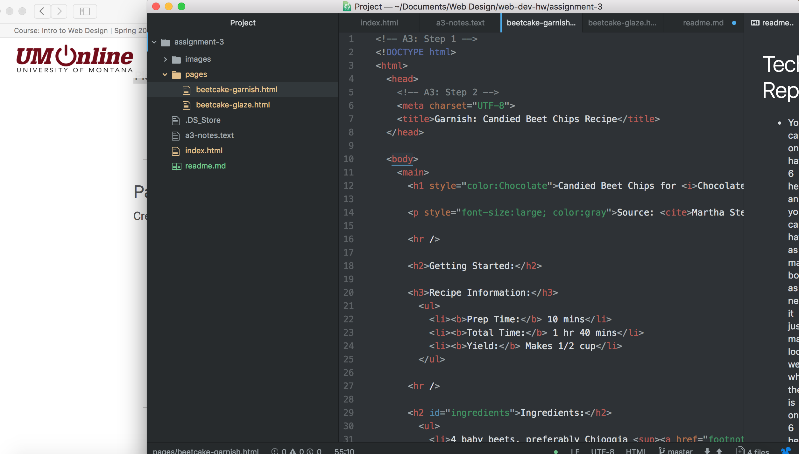

<!DOCTYPE html>
<h1>Technical Report</h1>

<ul>
  <li>You can only have 6 headings, and you can have as many body's as needed it just may look weird when there is only 6 headings.</li>
  <li>Structural is the compete layout of the page, basically its road map. The sematic layout is the smaller things like quotes, citations, definitions, addresses and more.</li>
  <li>My work cycle for this page was different, I had to go back to previous assignments and older things to refresh my memory. It also consisted of a lot of time because this assignment was far more difficult than anything else we have had.</li>

