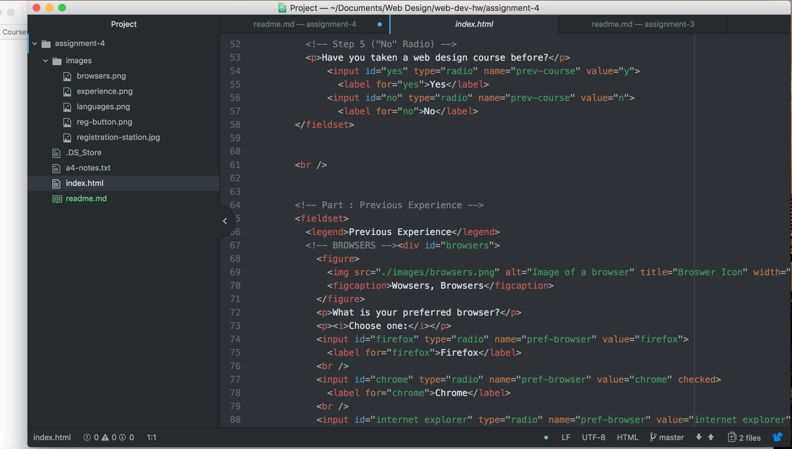

<!DOCTYPE html>
<h1>Technical Report</h1>

<ul>
  <li> alt text is used on documents to tell web site viewers the nature and content of an image</li>
  <li>I've come across a few but alt text definitely sticks out the most</li>
  <li>My work cycle for this page consisted of going back and forth from my assignment to the directions and the course website to make sure I was doing it correctly. It also consisted of taking breaks when I get stuck and going into office hours</li>

  
