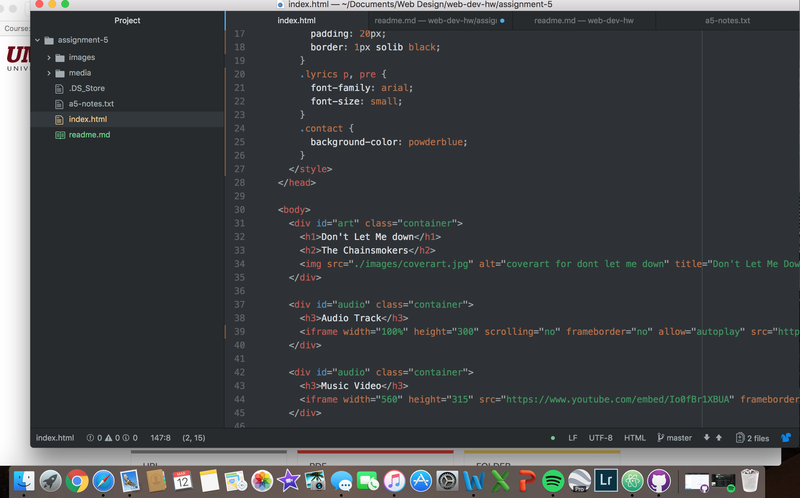

# Technical Report assignment-5
* divs: offers a block-level development to group things together.
* classes: identifier and selector value for html elements.
* id: takes as its value a string, which should be a 'unique identifier' to that specific element.
* span: identify text that needs to appear visually on the rendered html page.

Self-hosted media requires a lot of bandwidth, and due to the size of most movie files, this can occur often when self-hosting. Third-party options provide you affordable solutions to this potential problem.

During this assignment the only thing I really struggled with was the style. Once I copy and pasted the style from the notes I feel like it only styled half of my assignment. Also I am having trouble posting to my live site. I am sure its just a simple step I am missing, but I can't figure it out.

