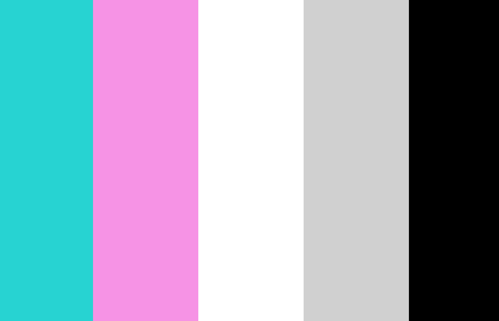

# Technical Report Assignment 6

* I chose the Bright circle graphic, it reminded me of Miami Vice so that is the theme I went with. I tried to style my page basic but very clean and centered.
* My color palette consisted of 3 bright colors, pink, orange and yellow. Their rgb was 255, 39. orange was FFAD48 and the yellow was FFFF00. I chose these because they matched well with my image.
* My work cycle consisted of reading through the assignment first. Then after that I started working by looking back at the website for help, I also went to office hours for more specific questions.

