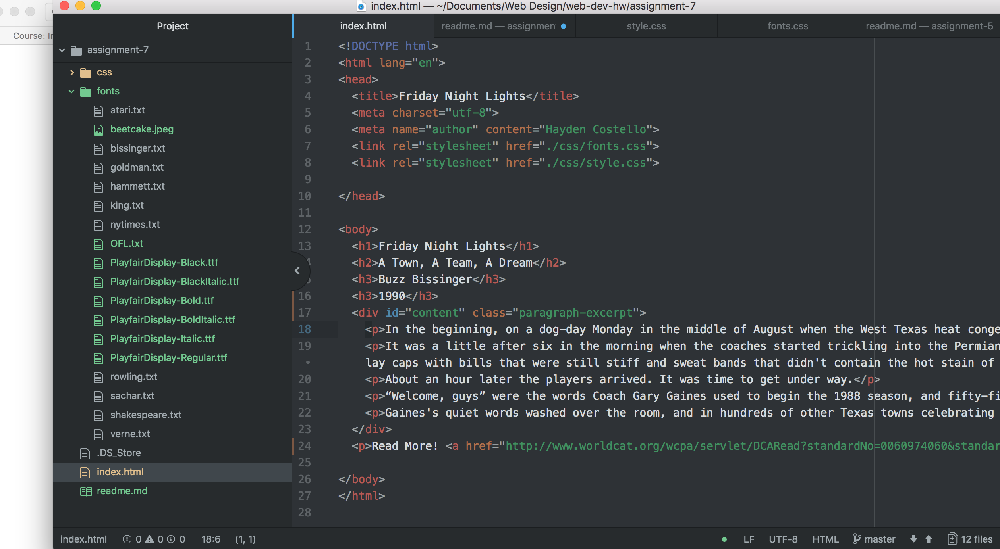

# Technical Report assignment-7
* For this assignment I went into office hours because I was very confused on switching to and from html and css. The fonts I chose were PlayfairDisplay and Noto Serif. I chose these because they were clean and I thought fit well with my text excerpt.
* Web-safe fonts are fonts like Arial and times new roman because they are automatically installed on the devices. Web fonts are not installed on every system.
* My work cycle for this assignment was the usual, looked over the assignment and directions then got my excerpt, fonts and colors ready then just followed the directions referening the website for help.

