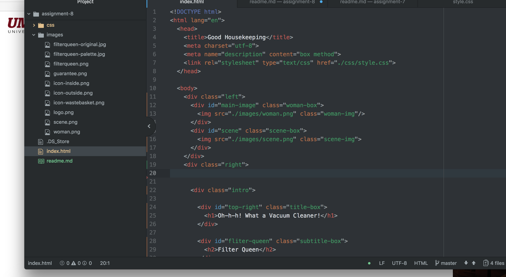

# Technical Report assignment-8
* Borders is around a specific div. Padding is the space in the specific div or box and the margin is the amount of space on the edges of the webpage.
* The entire thing was extremely difficult. I think the hardest part was the organization and the placement of everything.
* My work cycle for this assignment consisted of going through the directions, and the website then getting to office hours for additional help.

