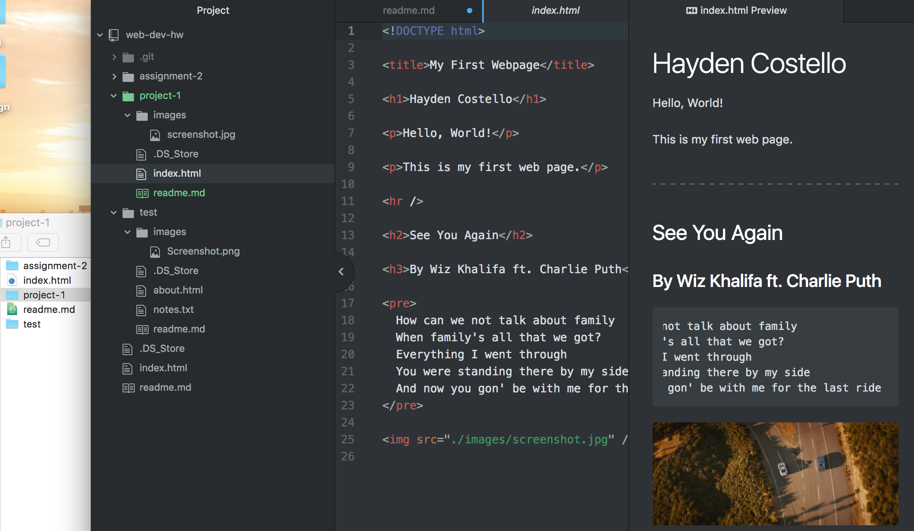

# Webpage readme File
## Hayden Costello

***

### Browsers:
- Safari
- Google Chrome

Browsers are built with HTML and when they are being used the browser interrupts those pages to display them on your computer.

The Wayback Machine was very interesting, I went to the Disneyland site from 2000 and it was very different. Very outdated in today's sake, but very advanced for that period in time.

My work cycle included going to the course website, following the instructions and referring back to HTML and Markdown shortcut sheets to reduce the time it took for me to complete the assignment.

