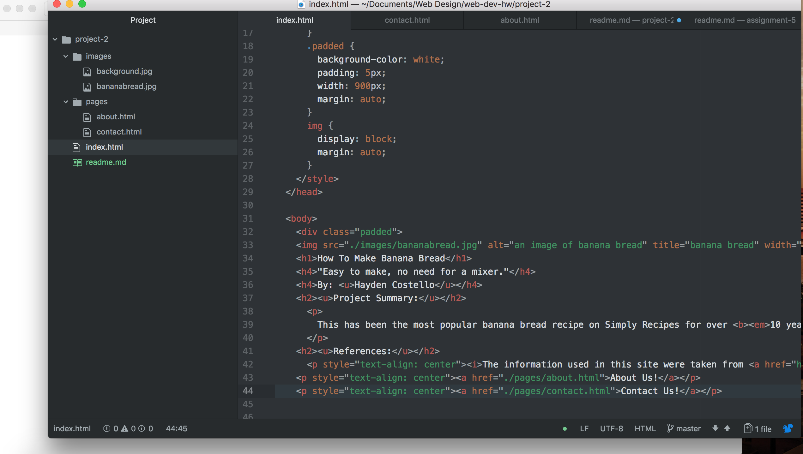

# Technical Report project-2
* This is actually my first time ever doing html so it took me awhile to get the hang of it. The part I found most frustrating was the forms, I'm not sure why they just seemed to be my achilles heel. Even though it was a lot of coding I liked how organized in looked in atom, by taking my time I was able to have well organized assignments.
* I'm excited to learn the new styling methods. I feel like before it was, in a way, limited on to what we could do. Now, I hope there are more clearer ways to style my assignments.
* My work cycle for project-2 was like previous assignments. I would review old topics, read through all the directions and pull up an example to help guide me through the assignment. By having the example provided by Professor Evans I was able to visualize how mine should look when it is finished.

